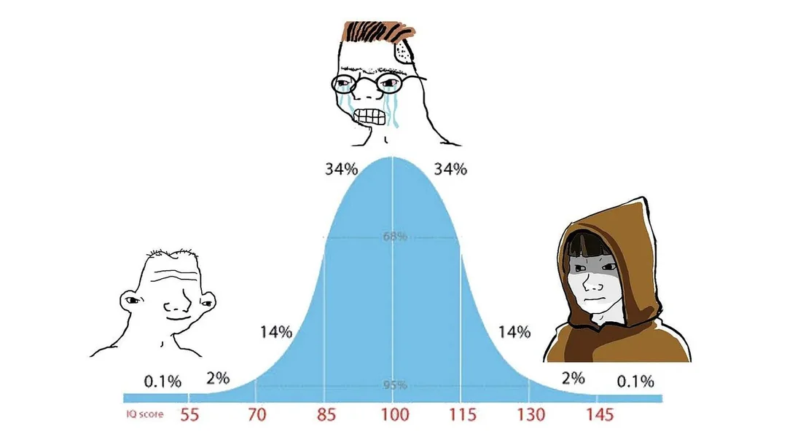

這應該是 2025 的接續，建議你可以先看看。不過不看也是沒有影響的。

剛剛跑完步洗澡的時候看到 Roy Lee 的一部影片，下面是我用 ai 處理的 transcript

> If you go to any Asian party or event at Columbia, the first thing you'll notice is none of these guys are talking to any of the girls. And I think it's so crazy that people in life will just not go after the things that they actually want. Almost everybody wants the exact same thing.
>
> They want a beautiful wife and family. They want to be healthy and fit. They want to make a lot of money.
>
> But every college student, even at Columbia, is at home all day. They don't fucking go to the gym. They don't start any businesses.
>
>And they talk to zero fucking girls. Okay, so how the fuck are you going to achieve any of these things? Let's maybe stop going to fucking JJ's at 2 a.m. Eating fucking cheeseburgers and french fries.
>
>Let's hit the gym, go on a diet, and start talking to girls. And start building companies. Because, you know, it's so crazy how people will literally all want the same things.
>
>And just never fucking work for them. Just put in the tiniest bit of effort, please. And, you know, like for all the Columbia Asian guys, you know who you are.
>
>Start talking to some girls.

作為一個有上進心的有為青年，應該要馬上點頭稱是然後主動說 “May I meet you”, 或是開始用 claude code 做一堆根本不需要出現在這個世界上的產品。
老實說我覺得沒有什麼問題，至少他們證明這是一條通向成功的路，但是在你想要沿這這條路通往成功之前，或許可以先停下來想清楚。

我當然知道我應該要勇於嘗試，而且我知道以我個人的能力或是偏好來說我有不少嘗試的機會的，至少我不討厭大多數的事或是說我是保持比較開放態度的(沒有主見)。
這就變成我的選項太多了我完全不知道自己該選什麼。然後我會覺得如果我失敗了我還有很多備案，就沒有”破釜沉舟”的決心。

我覺得我在我有限的記憶裡我努力想要嘗試達到的目標幾乎是沒有成功達成的，不管原因是什麼。
久了你就會對所有事情都失去信心，就是做什麼大該都是會失敗的，那你在決定要做一件事之前你就會想如果需要投入這麼多時間還是不會成功，
那你多花時間精力的意義是什麼。然後這種情緒還會蔓延，就是你會覺得對等的事你也做不到。
我連這麼”基本”的事都做不好，那我其他事當然也是做不好其他的事，我這些事都做不好我有什麼價值呢?

這就是一個悖論，你要先找到做一件事理由，這樣你才會有動力做這件事，然後如果成功了你就會獲得成就感，進而你就會更願意挑戰。
哪做這件事的理由是什麼？我要挑戰這件事的理由又是什麼？我覺得一個 20多歲的人應該是很難回答這個問題的

在 bell curve 上我應該就是在中間的那種人，或許哪天有時間我去擎天崗坐七天七夜就會坐七天七夜就會悟出真理。或是過二十年後我會覺得當初的自己很好笑

>Of course it was impossible to connect the dots looking forward when I was in college, but it was very, very clear looking backwards 10 years later. 
>Again, you can’t connect the dots looking forward. You can only connect them looking backwards, so you have to trust that the dots will somehow connect in your future. 
>You have to trust in something--your gut, destiny, life, karma, whatever--because believing that the dots will connect down the road will give you the confidence to follow your heart, even when it leads you off the well-worn path, and that will make all the difference.
>
> ...
> Don’t lose faith. I’m convinced that the only thing that kept me going was that I loved what I did. 
> You’ve got to find what you love, and that is as true for work as it is for your lovers. 
> Your work is going to fill a large part of your life, and the only way to be truly satisfied is to do what you believe is great work, and the only way to do great work is to love what you do. 
> If you haven’t found it yet, keep looking, and don’t settle. As with all matters of the heart, you’ll know when you find it, and like any great relationship it just gets better and better as the years roll on. So keep looking. Don’t settle.