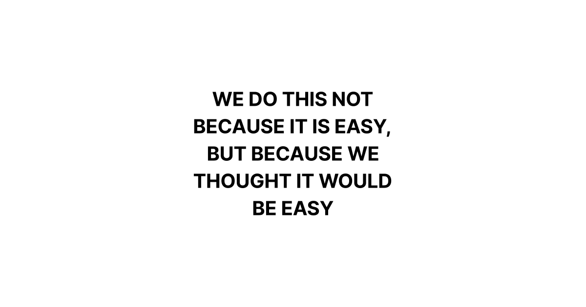
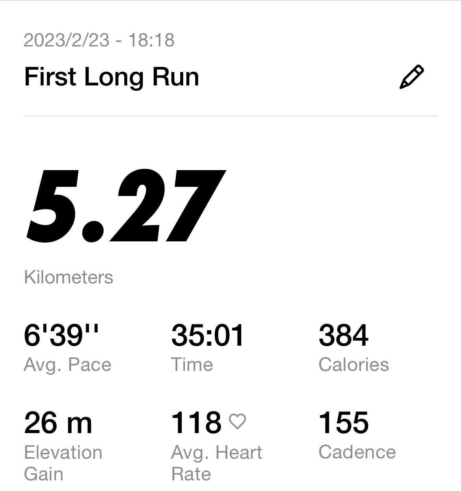
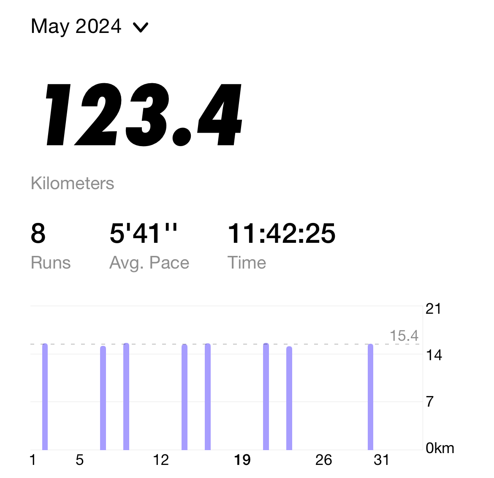

# My First Marathon

其實跑完馬拉松的當下沒什麼特別的感覺，除了抽筋很痛以外(有照片為證但是我沒花錢買)真的沒什麼特別的感覺。只有坐公車回家的路上突然意識到自己真的跑了好遠。(訓練的時候最多跑了32公里而已)

## WHY

跟很多人不一樣，一開始我真的不是為了參加比賽而跑步。剛開始會想有規律的開始跑步是上大學一年胖了幾公斤，想起以前還在學校的時候很多學長回來變胖的樣子，於是想找一個可以堅持下去的運動。我想到是重訓或是跑步，因為這兩者符合幾個條件

1. 一個可以自己做。原因很好解釋，~我沒有朋友~ 很多人會說一起做事可以互相鼓勵之類的，但是根據我的經驗我應該都是鼓勵別人的人，我不喜歡麻煩別人。
2. 盡可能減少身體受傷的風險，但是這後面會提到

最後因為我嫌健身房貴加上我的鞋子都是運動鞋所以我就選跑步了(更正確的說法應該是我選擇在家裡做伏地挺身，畢竟跑步不會練到我的二頭、三頭... 這些有視覺效果的肌肉)

然後其實蠻有趣的，為什麼會選一週二練呢？當時課表非常的滿，只有兩天是不用上滿的。結果跟很多人的選擇剛好是一樣的，像是學校的田徑隊、當地的跑團、劇團(不要懷疑，我學校的劇團會團練跑步) 剛開始想說就抓30到40分鐘吧，也就是差不多 5km 的距離。
然後覺得 5k 太短的就換成 10k，最後變成 15k。

接著就遇到了一些問題，15k 以後要做什麼呢？ 21k 大該要兩個多小時我沒有這麼多時間，而且夏天如果還是用一樣的方式訓練的話天氣太熱根本沒辦法完成訓練。最重要的是我想嘗試參加馬拉松看看

## 跑團

一次我朋友就傳的一個 Dcard 上的文章給我，就是說有一個跑團在招募新人，我就想說去試試看就參加了。反正對我來說也沒什麼改變，我也是差不多的時間到，然後大家聊個天加熱身，接著就是看要跑什麼，然後就看他們要跑什麼。至少讓我對如何有效率的訓練有不一樣的認識。跟他們聊天我也知道一些像是跑鞋、比賽之類的話題，讓我發現另外一片新大陸。

## Sisyphus and the Impossible Dream

  <iframe width="560" height="315" src="https://www.youtube.com/embed/9IiTdSnmS7E?si=ElC5ZmzLIMqOg9uP" title="YouTube video player" frameborder="0" allow="accelerometer; autoplay; clipboard-write; encrypted-media; gyroscope; picture-in-picture; web-share" referrerpolicy="strict-origin-when-cross-origin" allowfullscreen></iframe>

我會想參加馬拉松很大一部分的是因為 [CaseyNeistat](https://www.youtube.com/@casey) 的這部影片。 他 2007 出了個車禍，然後醫生跟他說他以後都不能跑步，於是決定要在一個不可能的時間 (2'59) 完成馬拉松。然後他就一路到了 2023 才成功。這時候一定有人會問：「哪你想跑步的原因是什麼呢？」我只能說我不知道，就覺得自己做了一件很酷的事。

雖然當時我覺得跑完半馬或許不是一件很困難的事，但是也很清楚全馬不是兩個半馬，所以當時我就想那我先從半馬開始好了，於是我就跟著我們跑團一樣的人報名台北馬拉松的半馬。雖然我是少數在 [500 ERROR](https://www.instagram.com/p/C_4gz0sTSQl/) 倖存下來的人，但是我忘記繳費 (FYI, 台灣的馬拉松如果是用超商繳費需要在 **"隔天下午兩點前"** 完成繳費，不然名額就會被放出去) 所以我就沒辦法參加了。不過沒關係，反正台灣的馬拉松絕對夠你跑，雖然我還是希望可以參加比較大的比賽，因為相對的配套措施更多，安全性也是比較高的，而且作為一個沒有辦法一年參加多場比賽的人，選比較有名的賽事還是更實在。

然後時間快轉到十月，萬金石馬拉松開始報名。這場賽事符合我前面描述的需求，但是只有全馬。我就好玩就順手填資料，結果沒想到竟然就正取了！但是我覺得直接挑戰還是不太現實，所以我又報名了另外一場半馬 (金門馬拉松) 當作練習。

你可能覺得跑馬拉松不就是雙腳邁開開始跑。但是如果你要跑得快、安全你要考慮的事情就很多了，從一開始的訓練計劃，到跑步的裝備、補給、配速策略，都是一門學問，而且到最後都是各家言論自成一派。所以還是需要透過一些經驗的累積來找到適合自己的模式。

裝備以及補給 (需要花錢的項目) 就是看一些網路上的推薦然後自己去試試看。我曾經找一天在信義區把幾家賣鞋子的店面都去試過一次，但是我後來覺得其實也不需要這麼大費周章，如果是好產品其實大家基本上人手一件，所以就看喜歡的去試試看其實基本上不會錯。如果買錯的其實也沒有這麼糟糕，反正這些東西也是消耗品。

訓練方面，我自己使用的方式是 [Strava 跑者訓練計劃](https://www.strava.com/training-plans/running) 我覺得如果沒有教練的情況下付費訂閱 Strava 至少可以幫助你自己分析自己的狀況、可視化一些資料 (我是用 Apple Watch，如果你是用 Ｇarmin 說不定本身的程式分析功能就夠了) 。我是覺得這份計劃如果選一週運動三天對想要追求成績的人來說可能不足，但是話說有時候計劃本身的也是帶有一些安慰的功能，就是你會覺得只要我按照計劃跑下去就會成功。

剛開始我課表用的是半馬的課表，跑完金門馬就過年了我在老家也只能找時間出去跑步維持訓練而已。等到過完年發現時間不多的但是自己都還沒有進行長距離的訓練，所以就把往後的課表加大，想說這樣可以彌補之前沒有跑的進度。事後復盤我認為課表應該還是要早一些開始比較好，對於跑量少的我來說提早把量加到本來該有的水準對比賽比較有幫助，至少我現階段自我評量應該是不需要考慮跑太多的問題。

比賽過程其實比想像中簡單，由於我起跑的位置太後面加上我前面的策略偏保守(根據計算我的配速應該在 5'10，但是我只跑 5'20左右) 所以其實是相對輕鬆的。可是到 34km 也就是傳說中的"麥當勞坡" 我的大腿就感覺不太妙了。於是我就放慢速度到 6'00 左右，過了一兩公里開始下獅頭山，我又覺得自己可以了，於是就把速度加回去，沒想到在 39km 我的大腿、小腿同時抽筋。平常抽筋通常是一到兩條的肌肉，但是我當是是大腿的左、右後，小腿的左、右都抽筋。當下你也站不直，想蹲下去也蹲不下去，膝蓋功能完全喪失，最後就跑 800 公尺走 200 公尺直到過終點。

我自評幾分呢？ 我覺得 60 吧。畢竟我最終成績有達到我設定的底標 (四小時)，但是我設定的另外一個目標是沒有達成的，那就是不要停下來。我覺得就是經驗不足所以對自己體能的極限沒有認知以及缺乏經驗，希望下次可以記取教訓。

## CONCLUSION

首先先聲明，如果單純追求健康的話我覺得一年跑個半馬驗證自己的身體狀況其實非常夠了。但是人都是有慾望，希望自己跑更遠、跑更快。我覺得這不是什麼壞事，至少人生有一個我願意追求的事情可以一直做下去。

我為什麼會喜歡跑步？我其實也說不出原因。大該就是一種“我今天又用我的意志力讓我做一件很多人都做不到的事”。

> Do something that sucks every single day of your life. that's how you grow

滿足自己的虛榮心吧？
