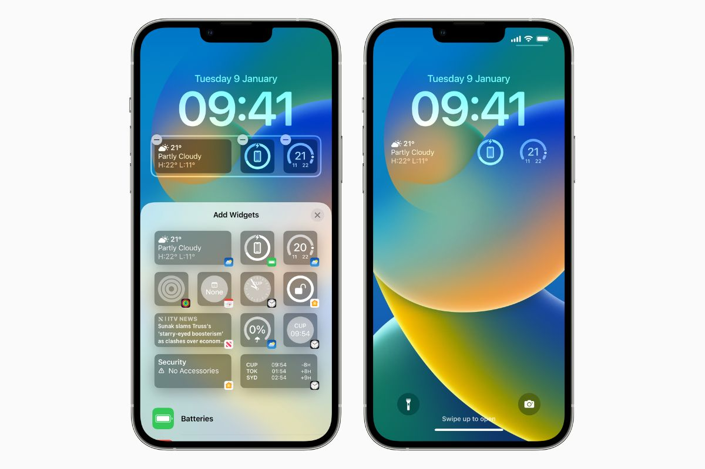

# Hack The Campus

如何改造學校的 APP

> 本文所提供之資訊僅供學術研究與教育用途，並不鼓勵或支持任何未經授權的入侵、攻擊、或違法行為。文中提及的工具、技術與方法僅供合法環境下進行測試與學習。
> 讀者需自行對其行為負責，作者不承擔任何因使用本文內容而導致的直接或間接損害。請遵守當地法律與相關規範。

## Why

> iOS Lock Screen

大一的時候那時候 Apple 推出新版的 [iOS 16](https://support.apple.com/en-us//101566)。iOS 16 我最喜歡的功能是 Lock Screen widgets
雖然以前就可以在右滑的地方放幾個 widgets，但是直接螢幕點亮就可以看到一些必要的資訊還是很更加順手。雖然我稱不上是一個好學生，但是我基本上沒理由不會翹課。
我自然會希望可以在這個地方看到課表。而且我知道很多人都有這個需求，比較暴力的方法就是截圖學校校務系統的畫面，
比較優雅的方案可能就是下載一個專用的程式 (我就是這樣) 或是手動在日曆中輸入。

可是這幾個方案都有一個問題，就是一開學就要手動輸入，先不討論當時我每天從早八上到晚上6點這麼多堂課輸入完要花多少時間，萬一學期中課程有改動的話呢？
這時候我就把頭腦動到 APP。雖然我知道一定有個什麼 API 可以用來獲得資料，但是當時我不知道在 iOS 設備上如何抓封包分析，
確切的說我知道可以透過電腦做這件事但是如果要開發 iOS APP 需要一台 Ｍac，而我當時沒有所以也就不了了之了。

## 另一個問題

### 做筆記

其實我還有一個痛點。我們學校有用一套系統來進行數位化的教學，同學們可以用平板加筆就可以取代一大疊書加上講義、各種筆。
網頁端的下載文件應該有手就行了 (我曾經在大學教過別人什麼是路徑所以...) 至于有些文件基於版權或是其他的理由不能下載？
iykyk

但是行動裝置就沒這麼幸運了，雖然 APP 中確實有下載的按鈕，但是我們需要的不只是離線可以閱讀，我們要可以用筆在上面畫重點，寫筆記，上述提到的功能學校
的 APP 都沒有實現，所以我的腦袋又想到抓封包這件事了，而且要在單獨的裝置上就可以運作，不然這樣的話我還不如直接拿電腦出來。

### Proxyman

在一個偶然的機會我發現 [Proxyman](https://proxyman.com/)，雖然沒付費的話功能有點少，但是對於要在手機/平板上看到網路請求也不是什麼難事了。
所以我們現在就可以像是在電腦上達到一樣的效果，而且不需要什麼繁瑣的步驟，打開 VPN、設定 SSL Proxying List ，然後就可以看到我們要的東西了。
