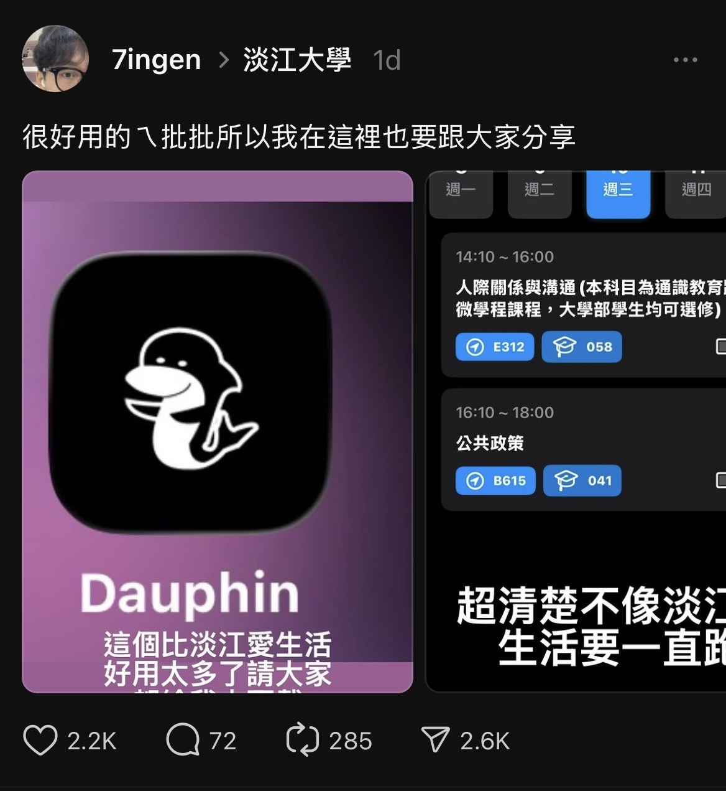

[DO WHAT YOU CAN'T](https://www.youtube.com/watch?v=jG7dSXcfVqE#) 是少數我在 YouTube 按讚的影片。
雖然主題確實有些雞湯，以及我個人非常討厭拍自己，但是我還是覺得這部影片有激勵到我。
是啊，我們就是應該去嘗試更多我們認為不可能的事，不要被框架束縛。可是更多時候我們連做好我們有能力做的事的能力都沒有。

## School
今年又到了做選擇的一年，三年多前根據能力(成績、軟實力等等)上了現在的學校以及科系，現在又到了再次選擇的時刻。
台灣電機系的大學畢業生應該就是上研究所 強者還要精益求精 選擇正確的實驗室 跟到正確的教授，以期待在一到兩年後進入公司拿到令人羨慕的薪水。
很多人對此有非常多的批評，例如把我們國家的高知識份子變成廉價勞工壓榨。
我很好奇電機系問學生選擇電機系有多少比例的人會說錢。

我也想嘗試走這條路，我從大概一年半前就開始補習了。
就是去補習班看影片，然後回家如果有空會看一下題目。
到了今年暑假開始的時候就正式進入狀態，我的暑假基本上就是每天上課上到晚上，如果晚上沒上課就去國家圖書館自習，回家就差不多睡覺了，開學以後地點就換成學校的圖書館而已。
我其實對這種填鴨式的方法是否有效存疑，我覺得這些比我們還會讀書的人都要用幾倍以上的時間學會的東西我們卻妄想在短短的半年內學會。

雖然在寫這段的當下雖然還沒考完，但是我覺得有一個重要的資訊你必須先知道，你考上研究所的機率是多少？
補習班招生人員以及老師很喜歡用一些話術來讓你覺得機會很大，例如某個 xx 科大的考上台大電機，或是你們前幾屆有一個很混的學長也考上的。
透過這些話術讓你覺得
> 如果這些人都可以，為什麼我不行？

但是其實透過簡單的搜尋就可以看到今年以及歷年報名人數以及錄取人數。這邊以中山大學電波領域聯合招生為例。

|學年度|報名人數 (考試入學)|招生名額|
|------|---------------|-------|
|115 (2026)|274|11[^1]|
|114 (2025)|364|11[^2]|
|113 (2024)|276|11[^3]|
|112 (2023)|278|11[^4]|
|110 (2021)|199|10[^5]|

基本上各個學校系所都差不多，假設是把每一次報考視為獨立事件， $n$ 表示報考次數，所以我們可以得到下面的公式。
$$
1 - 0.97^{n}
$$
一般來說 $n \approx 6$ 所以 
$$
1 - 0.97^{6} \approx 0.167028
$$
其實還有一個是針對我自己的計算方式。
補習班會把每年的榜單貼在外面，找一下有沒有自己學校的，然後除以你在課堂中看到同學數，我自己算過也差不多是這個數字。

也不是說要為自己找藉口。
不可否認這個考試對可預見的未來影響是非常大的，我也是盡我自己的可能來準備，但是寫歷屆試題的時候我還是覺得很難受，很多題目對我來說就是你隱約知道該如何解，但是就是想不起來關鍵的步驟。
雖然不會覺得意外，但是還是覺得自己就是智障，這輩子就這樣了。
不過後來想一想，從我們前面的到的數字，把所有考生的聰明才智、努力用功的程度加權排名(根據我的學校，以及我在學校的排名，還有周圍的人用功的程度)，我清楚地知道自己是不可能排進前 20% 的。
如果題目難到大家都不會，那是考運，也就罷了；如果題目大部分人都會我卻不會，那是學藝不精，回去再練。我依然會盡力。如果運氣好考上了，那就好好善用這個機會。

## Running

跑步對目前的我來說就是生活中前 3 重要的事。
我去年跑了 1,986.6 km 一共 182 小時 11 分鐘，參加了四場路跑

|Date|Name|Distance|time|
|---|-----|--------|----|
|2025-01-19|金門馬拉松|21.14 km|1:49:40|
|2025-03-16|萬金石馬拉松|42.37 km|3:58:05|
|2025-10-26|長榮馬拉松|21.37 km|1:46:44|
|2025-12-21|台北馬拉松|42.96 km|3:48:26|

一開始是被別人慫恿報名了萬金石，沒想到真的上了。
雖然過程不是非常好，人生第ㄧ次清楚感覺到腿部的個肌群，但是結果我也覺得滿意。
沒想到下半年的賽事成績全部不如預期，甚至還受傷(應該是近端膕旁肌肌腱病變)。雖然會影響成績的因素很多，但是我覺得更多的是訓練方式不對。

長跑是一項有趣的運動，訓練的強度不會反應到成績上，你每天跑得要死要活成績不一定會進步。
不是說有機會不勞而獲，而是要做正確的訓練。
我覺得我的問題就是忽略"輕鬆跑"，之前一方面我的觀點就是持續推進，覺得練到氣喘吁吁，滿頭大汗才是有訓練到。
再來是我覺得我都跑兩三年了，在那邊慢慢跑不是 "退步" 嗎？看到操場上大家都衝來衝去，所以就會一直把應該要慢慢跑的訓練偷加速，結果就是訓練的品質非常不好。

事實上台北馬結束後到目前為止我還沒有跑超過六分速過，一方面是受傷，一方面是我想要重新找回跑步的感覺。
跑步跟別人比較絕對是不應該的，生活中要比較的東西已經這麼多了，為什麼還要再把時間精力給在操場旁邊一閃而過的人呢？

> Slow is Smooth. Smooth is Fast. 
>
> -- <cite>F1: The Movie[^6]</cite>

## Building
說到寫程式，今年 10 個軟體工程師裡會有 15 個會提到 `vibe coding`[^7] 。
不過我不想現在就談論這個，我想說一個更有趣的議題。

我去年上架了一款 iOS App。
簡單來說就是我覺得我們學校的校務程式太難用，所以我自己花了一些時間做了一款程式出來，然後我怕有人會擔心安全方面的問題所以我直接[開源](https://github.com/tkuitocc/dauphin-ios) 出來。
最後一次大版本的[更新](https://github.com/tkuitocc/dauphin-ios/releases/tag/v1.1.3)應該是今年的三月份，接著就因為我要考試所以就沒有什麼大動作的更新了。

雖然用過的都說好，但是都是我認識的人所以我覺得不客觀，畢竟從 App Store Connect 看到的銷售數據就是不好。
我也沒做什麼宣傳。我甚至覺得因為效益不彰所以我沒有續費明年的 [Apple Developer Program](https://developer.apple.com/programs/)。
結果在今年 12 月的某天凌晨，我朋友傳一個 [threads](https://www.threads.com/@7ingen/post/DSDBPDNkze_) 給我。我早上起來一看，1.2k likes。到了中午打開 App Store 我的程式在教育類排名第 3，當天最好的成績是 Taiwan Top Free Apps 第 62。
隔天也是我第一次在學校裡面看到我完全不認識的人在我前面使用我的程式，或是桌上的手機上面是我寫的程式的畫面。

這件事有趣的點就是，我的程式早在將近一年前就完成的差不多了，學校 App 很糟糕這件事大家也都是常常在抱怨，但是大多數的人在看到這篇 [threads](https://www.threads.com/@7ingen/post/DSDBPDNkze_) 之前是不知道這個解決方案的，我也一直以爲這個需求只有我有而已。
作為一個開發者，我會覺得如果我東西做得很好，那大家自然會來使用。以及如果我推銷自己，結果事實上人家認為我做的東西不夠好，那我的名聲是不是就壞了。
這部分是正確的，我們應該要愛惜名聲，不要做 slop [^8] 但是我們同時也要讓需要的人知道我們是存在的。
近一步說向別人推薦自己的產品也可以算是一種品質保證吧?如果你要臉的話。

AI 的部分我應該會專門再寫一篇

之前會在家裡煮東西的時候會一邊煮東西一邊聽 podcast。
記得聽過有一集的 [Modern Wisdom](https://open.spotify.com/show/0XrOqvxlqQI6bmdYHuIVnr) 

> [When you're winning, you're not as good as you think you are. When you're losing, you're not as bad as you think  you are.](https://youtu.be/dMPLCie1G_I?t=4170)

希望如此

[^1]: [國立中山大學115學年度碩士班考試入學招生考試報名人數表](https://oaa.nsysu.edu.tw/static/file/3/1003/attach/94/pta_236860_1850500_62490.pdf)
[^2]: [國立中山大學114學年度碩士班考試入學招生考試報名人數表](https://oaa.nsysu.edu.tw/static/file/3/1003/attach/78/pta_219489_1482804_19917.pdf)
[^3]: [國立中山大學113學年度碩士班考試入學招生考試報名人數表](https://oaa.nsysu.edu.tw/static/file/3/1003/attach/54/pta_201209_2139506_37603.pdf)
[^4]: [國立中山大學112學年度碩士班考試入學招生考試報名人數表](https://oaa.nsysu.edu.tw/static/file/3/1003/attach/1/pta_181096_4413615_21864.pdf)
[^5]: [國立中山大學111學年度碩士班考試入學招生考試報名人數表](https://oaa.nsysu.edu.tw/static/file/3/1003/attach/3/pta_143878_919136_94947.pdf)
[^6]: [F1: The Movie](https://www.imdb.com/title/tt16311594/)
[^7]: [Vibe coding From Wikipedia, the free encyclopedia](https://en.wikipedia.org/wiki/Vibe_coding)
[^8]: [slop](https://www.merriam-webster.com/dictionary/slop)