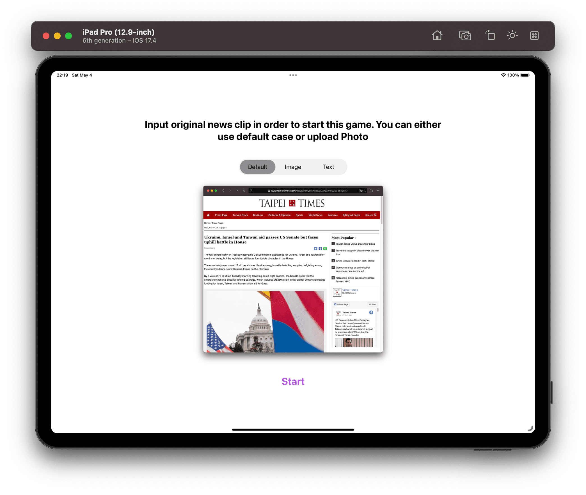

# 2024 VVDC Swift Student Challenge 覆盤以及一些的看法、計畫

> [!WARNING]
> 本文的作者為一個沒有任何實務的大學生，因此對某些事情會有主觀片面的想法。在閱讀此文的時候建議多方求證，不必太認真，必要時可以聯絡筆者。

首先先介紹我參加了什麼活動

## What is Swift Student Challenge

根據官方的介紹

> Apple is proud to support and uplift the next generation of developers, creators, and entrepreneurs with the Swift Student Challenge. The Challenge has given thousands of student developers the opportunity to showcase their creativity and coding capabilities through app playgrounds, and earn real-world skills that they can take into their careers and beyond.

總而言之，就是為了培養更多的開發者願意幫助它們開發應用程式，所以他們對新鮮的肝中誘之以利(哪個開發者不希望被蘋果邀請去Apple Park玩耍)。我覺得這樣也是不錯的策略，算是一種廣告宣傳吧，透過更多有趣實用的程式可以加強他們所謂的“生態系”。同時這個獎項感覺是有參考部分“政治正確”的分數，雖然有些人對這種東西很反感，但是我覺得作為一個評分標準無可後非，畢竟技術最終還是要服務商業邏輯的。更詳細的內容可以參考[這裡](https://developer.apple.com/swift-student-challenge/) 
至於我為什麼會對這個領域有興趣主要就兩個部分吧，一方面是我覺得一個我們每天都在使用的裝置我們應該要更加善用這些工具(這裡的善用比較像是善用手機的sensor做一些有創意的作品)。另外一方面的原因其實跟我想學前後端的理由一樣，我覺得有些東西做的太垃圾了，但是我可能又常常需要用到這些東西，所以我就會想“改造”它。

## 我做了什麼

我剛開始的時候完全沒有任何的想法，本來我都不打算參加這次的活動了。但是我後來想說我這輩子能參加幾次所以我就去參考[這個網站](https://www.wwdcscholars.com/?utm_source=pocket_saves)基本上我就是看看得獎者做了什麼，算是一種靈感的激發。 
然後我就開始我的專案了，我想做一個模擬訊息傳遞過程中以訛傳訛的現象，一開始你可以從預設的圖片開始(一張Taipei Times)或者也可以自己上傳圖片或者是上傳一段文字

接下來每個人會隨機看到前面的人寫的東西，然後他們必須嘗試描述他們看到的東西並且記錄下來幫助接下來的人了解這件事情。我是以這種形式模擬你在網路上看到東西的然後告訴其他人你看到什麼的過程，有些人可能剛開始看到的就是錯的所以也是輸出錯誤的資訊。當然不排除有人刻意製造假消息，當然結果也是顯而易見的。

接下來你會同時看到一個人的紀錄以及原始的資訊，然後你要根據原始的訊息為這個人的紀錄打分數。就是在真和假之間找到評分，當然這個過程也是用亂數做到隨機的。

接著就會顯示一個結果，包含原始的訊息及一個真實度的曲線圖。其實這個圖表嚴格說是沒有什麼意義的，因為我把 x,y 軸上的數字都去掉了，但是還是可以看到真實性的變化。我就是做這一頁的目標是一個遊戲結束然後結算分數讓使用者觀察。

最後這個[專案](https://github.com/cantpr09ram/2024-SwiftStudentChallenge)是開源的

## 覆盤

就成果上我當然是不滿意的，但是我覺得問題是出在兩個部分

1. 就想法上我覺得應該還算有創意，但是實現出來的結果卻不盡人意，主要的原因應該是個人實力的不足，其中包含技術上面的不足(無法完全實現我想的)以及 UI/UX 我也是一竅不通。這方面只能靠多看、多學、多做來加強了
2. 想法不是很周到。雖然前面我覺得我這個想法不錯，可是活動畢竟是公司辦的，公司做一件事一定會有目的的，所以我還是希望可以加入一些他們想推動的技術創新(多使用一些新的技術)。但對現在的我來說還是看不懂蘋果的開發文件，看影片學習我覺得效率非常的低，而且一些東西我也找不到解決方案。

## 我目前對這個領域的看法、規劃

我想我應該不會選擇 iOS 開發作為我主要努力的方向，是少不會是主要的工作。首先這樣太侷限了，整個職業生涯就被一間公司綁定我覺得也不是個好主意，而且就按照蘋果現在這個樣子我都很好奇幾年後這間公司還會不會存在。但不可否認的是這間公司確實還是一間很有實力的公司，所以在我還有一些蘋果設備的情況下我還是會持續做一些有趣的專案來滿足我個人的興趣，當然希望同時也可以得到一些回報。希望未來可以見到在裝置上運行一些 AI 模型之類的機會，這樣的話應該可以實現更多有趣的創意。
